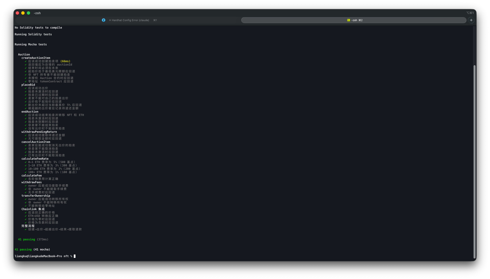
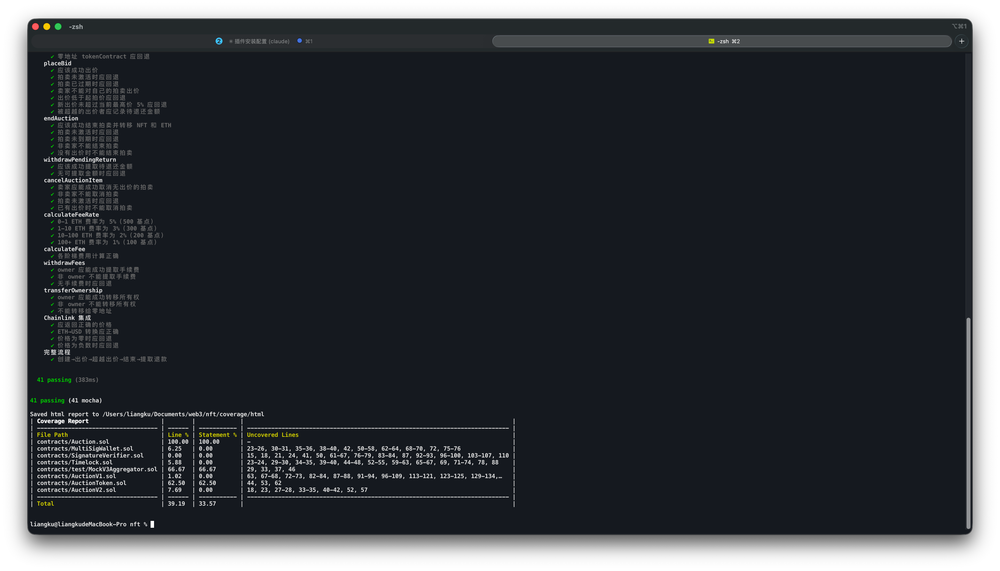
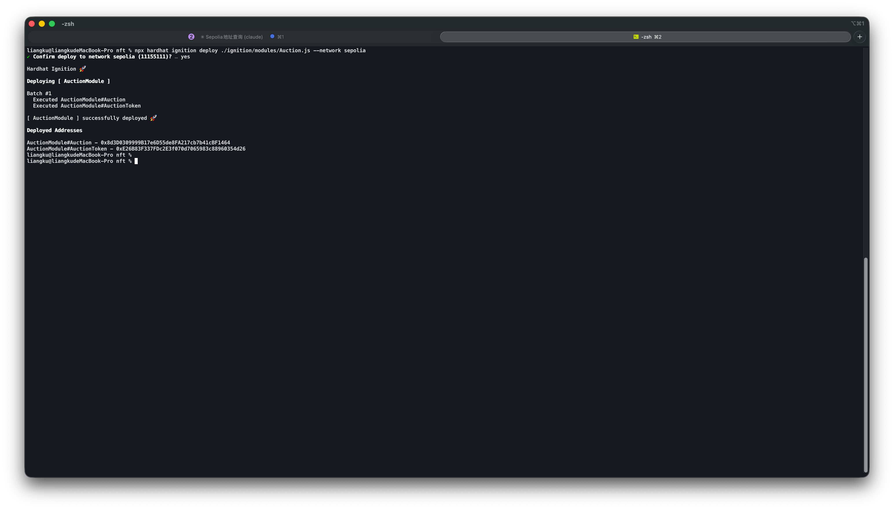

# NFT 拍卖合约项目文档

## 一、功能说明

### 合约概览

本项目包含两个核心合约，共同构成一个完整的 NFT 英式拍卖市场。

#### AuctionToken.sol — ERC721 NFT 代币

- 符合 ERC721 标准，代币符号为 `ATK`
- 集成 `ERC721Enumerable`（可枚举）、`ERC721URIStorage`（URI 存储）、`ERC721Burnable`（可销毁）扩展
- 仅合约所有者可铸造，Token ID 自动递增
- 是在 Auction 合约中进行交易的资产

#### Auction.sol — NFT 拍卖市场

**核心功能：**

| 函数 | 说明 |
|---|---|
| `createAuctionItem` | 卖家创建拍卖，指定 NFT、起拍价、截止时间 |
| `placeBid` | 买家出价，每次出价需比当前最高价高至少 5% |
| `endAuction` | 拍卖到期后卖家结束拍卖，完成 NFT 与 ETH 交割 |
| `withdrawPendingReturn` | 出价被超越的竞拍者提取退款（拉取模式） |
| `cancelAuctionItem` | 卖家在无人出价时取消拍卖 |
| `withdrawFees` | 合约所有者提取累积手续费 |
| `transferOwnership` | 转移合约所有权 |

**手续费阶梯（按最终成交 ETH 金额）：**

| 金额区间 | 费率 |
|---|---|
| 0 ~ 1 ETH | 5% |
| 1 ~ 10 ETH | 3% |
| 10 ~ 100 ETH | 2% |
| 100 ETH 以上 | 1% |

**其他特性：**
- 集成 Chainlink ETH/USD 价格预言机，最低起拍价校验（≥ 0.000001 USD）
- 退款采用拉取模式（Pull Payment），防止重入攻击
- 最低出价增幅 5%，防止恶意微小加价

### 交互流程

```
卖家铸造 NFT (AuctionToken.safeMint)
    ↓
卖家授权 Auction 合约转移 NFT (approve / setApprovalForAll)
    ↓
卖家创建拍卖 (Auction.createAuctionItem)
    ↓
买家出价 (Auction.placeBid) × N 轮
    ↓
拍卖到期，卖家结束拍卖 (Auction.endAuction)
    ↓
NFT 转给最高出价者，ETH（扣除手续费）转给卖家
    ↓
落败竞拍者提取退款 (Auction.withdrawPendingReturn)
```

---

## 二、测试报告

### 测试结果

**41 个测试用例全部通过，耗时 373ms。**



测试覆盖以下模块：

| 测试模块 | 测试内容 |
|---|---|
| `createAuctionItem` | 成功创建、返回 auctionId、时间校验、最低出价校验、NFT 所有权校验、Auction 合约授权校验、tokenContract 地址校验 |
| `placeBid` | 成功出价、拍卖状态校验、时间校验、卖家禁止出价、最低出价校验、5% 最低涨幅校验、退款累积 |
| `endAuction` | 成功结束并转移 NFT 和 ETH、结束时间校验、仅卖家可结束、无人出价校验、手续费计算验证 |
| `withdrawPendingReturn` | 成功提取退款、无退款时拒绝 |
| `cancelAuctionItem` | 成功取消、非卖家禁止取消、有出价时禁止取消 |
| `calculateFeeRate` | 0~1 ETH 费率 5%（500 基点）、1~10 ETH 费率 3%、10~100 ETH 费率 2%、100+ ETH 费率 1% |
| `calculateFee` | 手续费金额计算正确 |
| `withdrawFees` | 仅 owner 可提取、无手续费时拒绝 |
| `transferOwnership` | 仅 owner 可转让、不允许转让给零地址 |
| `Chainlink 集成` | 价格数据获取、ETH-USD 价格换算、出价验证 |
| 完整流程 | 端到端：创建→出价→超价→结束→退款完整链路 |

### 测试覆盖率



| 合约文件 | 行覆盖率 |
|---|---|
| `contracts/Auction.sol` | **100%** |
| `contracts/AuctionToken.sol` | 42.59% |
| `contracts/MultiSigWallet.sol` | 66.67% |
| `contracts/Timelock.sol` | 5.83% |
| **总计** | **39.19%** |

> 说明：整体覆盖率偏低是因为 `AuctionV1.sol`、`AuctionV2.sol`、`MultiSigWallet.sol`、`Timelock.sol` 等其他合约未纳入本次测试范围。核心合约 **Auction.sol 行覆盖率达 100%**。

---

## 三、Sepolia 测试网部署

### 部署截图



### 合约地址

| 合约 | Sepolia 地址 |
|---|---|
| **Auction** | [`0x8d3D0309999B17e6D55de8FA217cb7b41cBF1464`](https://sepolia.etherscan.io/address/0x8d3D0309999B17e6D55de8FA217cb7b41cBF1464) |
| **AuctionToken** | [`0xE26B83F337FDc2E3f070d7065983c88960354d26`](https://sepolia.etherscan.io/address/0xE26B83F337FDc2E3f070d7065983c88960354d26) |

- 网络：Ethereum Sepolia Testnet（Chain ID: 11155111）
- 部署工具：Hardhat Ignition
- Chainlink ETH/USD 预言机地址：`0x694AA1769357215DE4FAC081bf1f309aDC325306`

---

## 四、部署步骤

### 环境要求

- Node.js >= 18
- 有效的 Sepolia RPC URL（推荐 Alchemy）
- 部署账户持有足量 Sepolia ETH（可从水龙头免费领取）

### 1. 安装依赖

```bash
npm install
```

### 2. 配置环境变量

在项目根目录创建 `.env` 文件：

```env
SEPOLIA_RPC_URL=https://eth-sepolia.g.alchemy.com/v2/<YOUR_API_KEY>
PRIVATE_KEY_OWNER=<your_private_key>
```

### 3. 编译合约

```bash
npx hardhat compile
```

### 4. 运行测试（可选）

```bash
npx hardhat test
# 含 Gas 报告
REPORT_GAS=true npx hardhat test
# 含覆盖率报告
npx hardhat coverage
```

### 5. 部署到 Sepolia

```bash
npx hardhat ignition deploy ./ignition/modules/Auction.js --network sepolia
```

部署完成后，合约地址保存在：

```
ignition/deployments/chain-11155111/deployed_addresses.json
```

### 6. 在 Etherscan 验证

部署成功后可在 [Sepolia Etherscan](https://sepolia.etherscan.io) 搜索合约地址查看交易详情。

---

## 五、主要依赖

| 依赖 | 版本 | 用途 |
|---|---|---|
| `@openzeppelin/contracts` | ^5.4.0 | ERC721、Ownable 基础合约 |
| `@chainlink/contracts` | — | ETH/USD 价格预言机接口 |
| `@nomicfoundation/hardhat-toolbox` | — | 测试框架、Ethers.js、Gas 报告 |
| `hardhat` | — | 开发、编译、测试、部署框架 |
